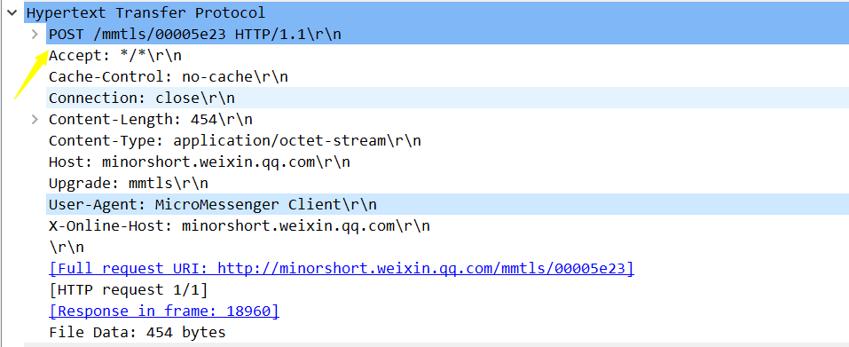

# 1. HTTP

## 1.1 什么是http协议?

## 1.2 http常见的状态码？

##1.3 http常见的字段？

### 1.3.1 *Host* 字段

客户端发送请求时，用来指定服务器的域名。

### 1.3.2 *Content-Length 字段*

服务器在返回数据时，会有 `Content-Length` 字段，表明本次回应的数据长度。

### 1.3.3 *Connection 字段*

`Connection` 字段最常用于客户端要求服务器使用「HTTP 长连接」机制，以便其他请求复用。

### 1.3.4 *Content-Encoding 字段*

`Content-Encoding` 字段说明数据的压缩方法。表示服务器返回的数据使用了什么压缩格式

### 1.3.5 Accept-Encoding: gzip, deflate

==响应==

==get请求==

==post请求==

## 1.4 GET和POST字段

### 1.4.1 GET 和 POST 有什么区别？

RFC 规范，GET 请求的**参数位置一般是写在 URL 中**，URL 规定**只能支持 ASCII**，所以 GET 请求的参数只允许 ASCII 字符 ，而且浏览器会对 **URL 的长度有限制**（HTTP协议本身对 URL长度并没有做任何规定）。

### 1.4.2 GET 和 POST 方法都是安全和幂等的吗？

- GET 的语义是请求获取指定的资源。**GET 方法是安全、幂等、可被缓存的**。
- POST 的语义是根据请求负荷（报文主体）对指定的资源做出处理，具体的处理方式视资源类型而不同。**POST 不安全，不幂等，（大部分实现）不可缓存。**

**注意， 上面是从 RFC 规范定义的语义来分析的。**

但是实际过程中，开发者不一定会按照 RFC 规范定义的语义来实现 GET 和 POST 方法。比如：

- 可以用 GET 方法实现新增或删除数据的请求，这样实现的 GET 方法自然就不是安全和幂等。
- 可以用 POST 方法实现查询数据的请求，这样实现的 POST 方法自然就是安全和幂等。

### 1.4.3 GET 请求可以带 body 吗？

RFC 规范并没有规定 GET 请求不能带 body 的。理论上，任何请求都可以带 body 的。只是因为 RFC 规范定义的 GET 请求是获取资源，所以根据这个语义不需要用到 body。

另外，URL 中的查询参数也不是 GET 所独有的，**POST 请求的 URL 中也可以有参数的**。

## 1.5 HTTP 缓存技术

###1.5.1 HTTP 缓存有哪些实现方式？

HTTP 缓存有两种实现方式，分别是==**强制缓存和协商缓存**。==

*具体的字段是怎么判断的后续可以再看看。*

## 1.6 HTTP 特性

到目前为止，早期 HTTP/1.0 ，现在HTTP 常见到版本有 **HTTP/1.1，HTTP/2.0，HTTP/3.0**，不同版本的 HTTP 特性是不一样的。

### HTTP 与 HTTPS 有哪些区别？

### 1.6.1 HTTP/1.1 的优点有哪些？

HTTP 最突出的优点是「**简单、灵活和易于扩展、应用广泛和跨平台**」。

### 1.6.2  HTTP/1.1 的缺点有哪些？

**无状态、明文传输、不安全**

1. ==**对于无状态的问题，**==解法方案有很多种，其中比较简单的方式用 **Cookie** 技术。
2. `Cookie` 通过**在请求和响应报文中写入 Cookie 信息来控制客户端的状态**。

​		相当于，**在客户端第一次请求后，服务器会下发一个装有客户信息的「小贴纸」，后续客户端		请求服务器的时候，带上「小贴纸」，服务器就能认得了了**，

### 1.6.3 HTTP/1.1 的性能如何？（对比与http1.0来说）

*1. 长连接*

*2. 管道网络传输*

*3. 队头阻塞*

## 1.7 HTTP 与 HTTPS 有哪些区别？

##1.8 HTTPS 解决了 HTTP 的哪些问题？

> **窃听、篡改、冒充**三大风险
>
> ==解决办法：==
>
> **信息加密、校验机制、身份证书**
>
> ==具体办法：==
>
> **混合加密、摘要算法+数字签名、数字证书**
>
> 

###1. 混合加密

### 2. 摘要算法+数字签名

==通过哈希算法可以确保内容不会被篡改==，**但是并不能保证「内容 + 哈希值」不会被中间人替换，因为这里缺少对客户端收到的消息是否来源于服务端的证明**

==**通过「私钥加密，公钥解密」的方式，来确认消息的身份**==，我们常说的**数字签名算法**，就是用的是这种方式，不过私钥加密内容不是内容本身，而是==**对内容的哈希值加密**。==

###3. 数字证书

## 1.9 HTTPS 是如何建立连接的？其间交互了什么？

SSL/TLS 协议基本流程：

- **客户端向服务器索要并验证服务器的公钥**。

- 双方协商生产「会话秘钥」。

- 双方采用「会话秘钥」进行加密通信。

- 前两步也就是 SSL/TLS 的建立过程，也就是 TLS 握手阶段。

  TLS 的「握手阶段」涉及**四次**通信，使用不同的密钥交换算法，TLS 握手流程也会不一样的，现在常用的密钥交换算法有两种：[RSA 算法 (opens new window)](https://xiaolincoding.com/network/2_http/https_rsa.html)和 [ECDHE 算法 (opens new window)](https://xiaolincoding.com/network/2_http/https_ecdhe.html)）==两种加密算法的区别在于，RSA不具有前向安全性，ECDHE算法具有前向安全性能，所以现在基本都是使用ECDHE算法==

### 1.9.1 TLS四次握手详解

==*1. ClientHello*==

首先，由客户端向服务器发起加密通信请求，也就是 **`ClientHello`** 请求。

在这一步，客户端主要向服务器发送以下信息：

（1）客户端支持的 **TLS 协议版本**，如 TLS 1.2 版本。

（2）客户端生产的**随机数（`Client Random`**），后面用于生成「会话秘钥」条件之一。

（3）客户端**支持**的密**码套件列表**，如 RSA 加密算法。

==*2. SeverHello*==

服务器收到客户端请求后，向客户端发出响应，也就是 **`SeverHello`**。服务器回应的内容有如下内容：

（1）确认 **TLS 协议版本**，如果浏览器不支持，则关闭加密通信。

（2）服务器生产**的随机数（`Server Random`**），也是后面用于生产「会话秘钥」条件之一。

（3）确认的**密码套件列表**，如 RSA 加密算法。

（4）服务器**的数字证书。**

==*3.客户端回应*==

客户端收到服务器的回应之后，首先通过浏览器或者操作系统中的 CA 公钥，确认服务器的数字证书的真实性。

如果证书没有问题，客户端会**从数字证书中取出服务器的公钥**，然后使用它加密报文，向服务器发送如下信息：

（1）**一个随机数（`pre-master key`**）。该随机数会被服务器公钥加密。

（2）**加密通信算法改变通知**，表示**随后的信息都将用「会话秘钥」加密通信**。

（3）**客户端握手结束通知**，表示客户端的握手阶段已经结束。这一项**同时把之前所有内容的发生的数据做个摘要，用来供服务端校验**。

上面第一项的随机数是整个握手阶段的第三个随机数，会发给服务端，所以这个随机数客户端和服务端都是一样的。

**服务器和客户端有了这三个随机数（Client Random、Server Random、pre-master key），接着就用双方协商的加密算法，各自生成本次通信的「会话秘钥」**。

==*4. 服务器的最后回应*==

服务器收到客户端的第三个随机数（`pre-master key`）之后，通过协商的加密算法，计算出本次通信的「会话秘钥」。

然后，向客户端发送最后的信息：

（1）**加密通信算法改变通知**，表示随后的信息都将用「会话秘钥」加密通信。

（2）**服务器握手结束通知**，表示服务器的握手阶段已经结束。这一项同时把之前所有内容的发生的数据做个摘要，用来供客户端校验。

至此，整个 TLS 的握手阶段全部结束。接下来，客户端与服务器进入加密通信，就完全是使用普通的 HTTP 协议，只不过用「会话秘钥」加密内容。

## 2.0 HTTP/1.1、HTTP/2、HTTP/3 演变

###2.0.1 HTTP/1.1 相比 HTTP/1.0 提高了什么性能？

HTTP/1.1 相比 HTTP/1.0 性能上的改进：

- 使用**长连接**的方式改善了 HTTP/1.0 短连接造成的性能开销。
- **支持管道**（pipeline）网络传输，只要第一个请求发出去了，不必等其回来，就可以发第二个请求出去，可以减少整体的响应时间。

### 2.0.2  HTTP/1.1 还是有性能瓶颈：

1. 请求 / 响应**头部（Header）未经压缩就发送**
2. 服务器是按请求的顺序响应的，如果服务器响应慢，会招致客户端一直请求不到数据，也就是**队头阻塞**；

### 2.0.3 HTTP/2 相比 HTTP/1.1 性能上的改进：

==HTTP/2 协议是基于 HTTPS 的，所以 HTTP/2 的安全性也是有保障的。==

- ==**头部压缩**==

  HTTP/2 会**压缩头**（Header）如果你同时发出多个请求，他们的头是一样的或是相似的，那么，协议会帮你**消除重复的部分**。

- ==**二进制格式**==

  HTTP/2 不再像 HTTP/1.1 里的纯文本形式的报文，而是全面采用了**二进制格式**，头信息和数据体都是二进制，并且统称为帧（frame）：**头信息帧（Headers Frame）和数据帧（Data Frame）**。

- ==**并发传输**==

  引出了 Stream 概念，多个 Stream 复用在一条 TCP 连接。

- ==**服务器主动推送资源**==

HTTP/2 还在一定程度上改善了传统的「请求 - 应答」工作模式，服务端不再是被动地响应，可以**主动**向客户端发送消息。

客户端和服务器**双方都可以建立 Stream**， Stream ID 也是有区别的，**客户端建立的 Stream** 必须是**奇数号**，而**服务器建立的 Stream 必须是偶数号**。客户端通过 HTTP/1.1 请求从服务器那获取到了 HTML 文件，而 HTML 可能还需要依赖 CSS 来渲染页面，这时客户端还要再发起获取 CSS 文件的请求，需要两次消息往返，如下图左边部分：

##2.1 HTTP/2 有什么缺陷？

HTTP/2 通过 Stream 的并发能力，解决了 HTTP/1 队头阻塞的问题，看似很完美了，但是 HTTP/2 还是存在“队头阻塞”的问题，只不过问题不是在 HTTP 这一层面，而是**在 TCP 这一层。**

##2.2 HTTP/3 做了哪些优化？

HTTP/2 队头阻塞的问题是因为 TCP，所以 ==**HTTP/3 把 HTTP 下层的 TCP 协议改成了 UDP！**==

UDP 发送是不管顺序，也不管丢包的，所以不会出现像 HTTP/2 队头阻塞的问题。大家都知道 UDP 是不可靠传输的，但基于 UDP 的 **QUIC 协议** 可以实现类似 TCP 的可靠性传输。

### 2.2.1 QUIC 有以下 3 个特点。

- ==无队头阻塞==

  **当某个流发生丢包时，只会阻塞这个流，其他流不会受到影响，因此不存在队头阻塞问题**。QUIC 连接上的多个 Stream 之间并没有依赖，都是独立的，某个流发生丢包了，只会影响该流，其他流不受影响。

- ==更快的连接建立==

  对于 HTTP/1 和 HTTP/2 协议，TCP 和 TLS 是分层的，分别属于**内核实现的传输层、openssl 库实现的表示层**，因此它们难以合并在一起，需要分批次来握手，先 TCP 握手，再 TLS 握手（另外， SSL/TLS 1.3 优化了过程，只需要 1 个 RTT 往返时延，也就是只需要 3 次握手）。

​		HTTP/3 在传输数据前虽然需要 QUIC 协议握手，**但是这个握手过程只需要 1 RTT**，握手的目的		是为确认双方的**「连接 ID」**，**连接迁移就是基于连接 ID 实现的。**

1.不需要TCP三次握手，只需要QUIC三次握手，其中包含TLS协议，一起完成了握手，所有建立连接只需要一个RTT，就可以实现连接和密钥的协商。

2.更离谱的事情是，在第二次连接的时候，可以直接和数据一起发送过去，实现0RTT。

- ==连接迁移==

1.TCP是通过四元组来确定一条连接。切换网络的时候，需要重新建立连接。

2.QUIC协议通过**连接ID**来标记通信的两个端点。

  因此即使移动设备的网络变化后，导致 IP 地址变化了，**只要仍保有上下文信息**（比如连接 ID、TLS 密钥等），就可以“无缝”地复用原连接，消除重连的成本，没有丝毫卡顿感，达到了**连接迁移**的功能。

  	  QUIC 是新协议，对于很多网络设备，根本不知道什么是 QUIC，只会当做 UDP，这样会出现新的问题，因为有的网络设备是会丢掉 UDP 包的，而 QUIC 是基于 UDP 实现的，那么如果网络设备无法识别这个是 QUIC 包，那么就会当作 UDP包，然后被丢弃。

HTTP/3 现在普及的进度非常的缓慢，不知道未来 UDP 是否能够逆袭 TCP。